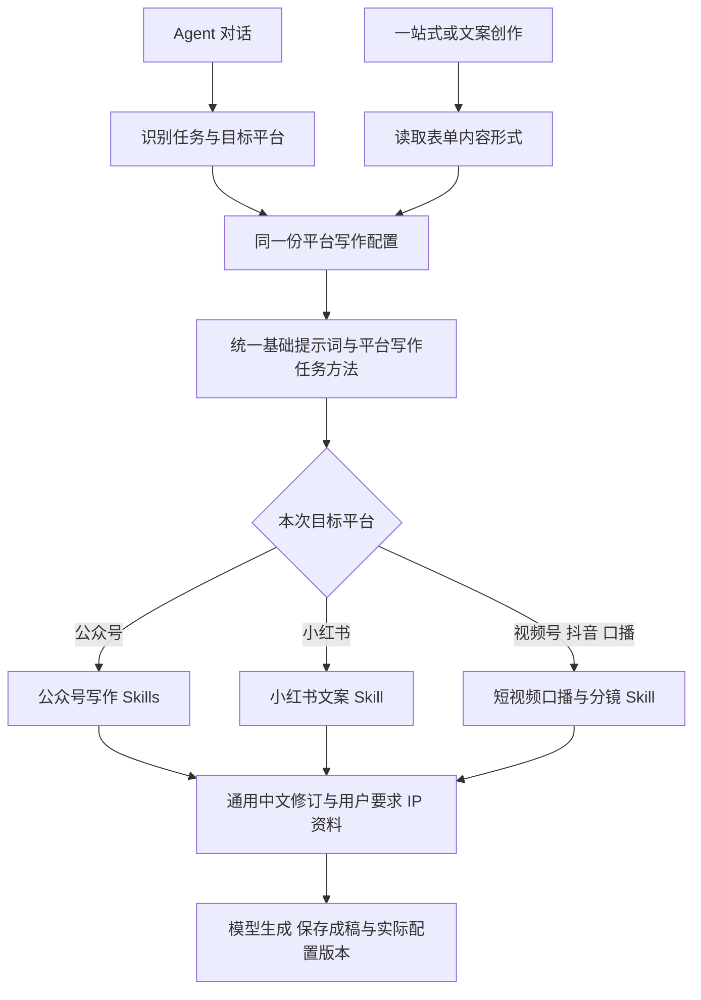

# 小红书与短视频方法接入

本次共用已有“平台写作”任务方法，新增“小红书文案与图文阅读节奏”和“短视频口播与分镜”两项中文 Skills。平台的具体写法放在 Skills；统一任务方法继续负责成稿目标、用户要求、事实边界与各内容形式的基本要求，不增加重复的 Agent 角色。

来源原文、固定提交、许可与中文适配说明见 [方法来源](../vendor/writing-skills/platform-sources/README.md)。公开热度用于筛选，不能代替实际文章质量评测。

## 调用关系

| 前台内容形式或 Agent 平台 | 使用的方法 |
|---|---|
| 公众号文章／公众号 | 平台写作 + 公众号限定 Skills + 通用修订 |
| 小红书文案／小红书 | 平台写作 + 小红书文案 Skill + 通用修订 |
| 口播脚本、视频脚本／视频号、抖音 | 平台写作 + 短视频口播与分镜 Skill + 通用修订 |
| 朋友圈、通用文案 | 平台写作 + 不限平台的通用 Skills |

Agent 在提交任务时冻结所有可能需要的写作配置，识别平台后从冻结内容中筛选；不会重新读后台的最新正文。多平台写作分别筛选。表单与选题交付也使用同一筛选函数。成稿里的配置版本、方法摘要哈希和请求摘要记录实际进入请求的内容。

## 后续新增 Skill

管理后台 → 统一 Agent 与方法 → Skills 方法库 → 添加 Skill。适用任务选“平台写作”，勾选适用写作平台；不勾选表示通用写作方法。保存并启用后，Agent 和一站式的对应平台请求共同使用；草稿、停用或删除的项目不进入请求。

预览选择“平台写作”后可以进一步选择具体平台，核对实际提示词；“所有写作方法”只是管理员审阅用的汇总，不表示每个成稿请求都会包含全部平台方法。平台绑定可以随版本恢复。已有公众号限定项目按其固定标识匹配公众号，用户自建且未指定平台的方法保持通用。

本次数字人下拉框直接平铺本人形象，去除“我的形象”标题；声音只有单一来源时也平铺，同时存在本人和公共声音时保留必要区分。选择、预览和默认值逻辑继续沿用现有实现。

## 验证与交付边界

验证应覆盖平台间方法隔离、共用方法、后台绑定与历史恢复、排队任务版本冻结、Agent 与表单实际请求、构建、后台预览和数字人选择页面。隔离测试的模型返回只用于验证调用逻辑，不作为真实文章或爆款效果证明。

第一轮只更新源码和本机方法配置，安装版 0.23.8 未替换，因此用户仍看到旧分组。第二轮已打包并安装 0.23.9；实际安装版数字人下拉框检查确认只有“选择数字人形象”和“风沙”，没有分组。安装目录的前端包与本轮构建一致，平台精确筛选和后台绑定界面已经进入安装版。

已完成：80 项后端回归通过；管理后台绑定、平台预览、启停以及三种屏幕宽度验收通过；数字人页面 12 项交互验收通过（含平铺选项、视频播放、选择回填、默认值相关操作与原稿保留）；TypeScript 与前端生产构建通过。没有真实付费模型调用或文章传播效果验证。

本机方法库由 22 项增加至 24 项，新增两项中文 Skills；四项原公众号 Skills 增加公众号限定绑定，原正文、启停状态与任务绑定未改动，历史版本保留。平台写作任务方法仍为 v4，Humanizer 中文完整适配仍为 v3。配置备份与逐项比对报告保存在 `.runtime/side-platform-skills-20261009-a69d42e9/`，写入使用数据库事务和配置一致性检查，未改动业务资料或账号。

第二轮仅更新两项平台 Skills 的正文为详细 v2：小红书从 1539 扩到 6396 字符，短视频从 1770 扩到 6005 字符。详见方法来源目录的 [覆盖对照](../vendor/writing-skills/platform-sources/中文详细版覆盖对照.md)。其他方法与用户自定义正文未改动，两项旧稿保存在各自历史版本中。

第二轮复验：80 项后端回归、后台平台绑定和预览、12 项数字人交互、生产构建、打包桌面启动、实际安装版版本与下拉框检查均通过。安装前后配置摘要、用户数量及各类资料数量核对通过，没有丢失原资料。备份与报告见 `.runtime/side-platform-fidelity-20261009-8062115f/`。安装包为桌面 `TISHIJIE-Setup-0.23.9.exe`；未调用付费模型比较真实成稿效果，也不宣称与上游效果相同。
