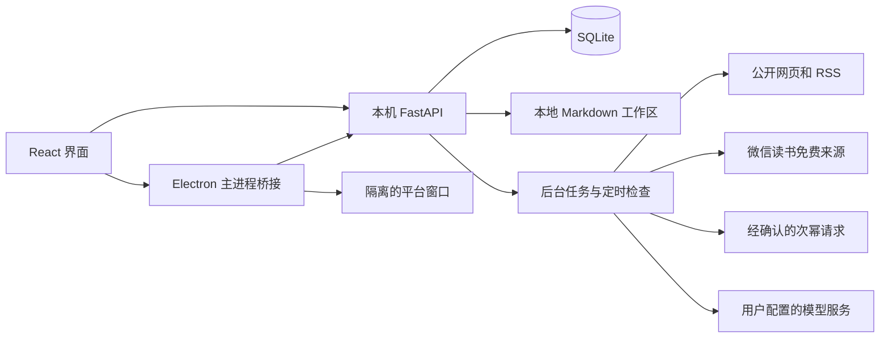

> 0.12.0 更新：对话后请点击“确定工作成果”；选题转文章和配图请参阅 [本次使用说明](0.12.0成果与文章配图.md)。

# 技术架构与数据说明

> 0.9.0 知识功能更新：原文直接提问、Wiki 自动整理、对话记忆、文件夹和参考范围，详见[当前设计与使用说明](个人知识工作台-设计与使用.md)。旧版候选审阅仅保留用于兼容。

适用版本：0.12.0。

## 结构

Electron 自动分配回环地址端口并启动后端；界面和 API 均在本机。纯浏览器开发模式由 Vite 代理请求；桌面登录与验证依赖 Electron 主进程。

## 代码导航

| 路径 | 职责 |
|---|---|
| `src/App.tsx` | 应用导航、账户、任务、创作、知识和管理后台 |
| `src/WorkPages.tsx` | 今日工作、雷达与阅读器 |
| `src/BenchmarkPage.tsx` | 对标内容四个业务视图 |
| `src/SettingsHub.tsx` | 六个模块的统一设置与返回入口 |
| `src/SubscriptionStatus.tsx` | 业务页连接状态摘要 |
| `src/AcquisitionMeta.tsx` | 来源与获取时间展示 |
| `src/WechatLibrary.tsx` | 公众号目录、付费确认、正文与导出 |
| `src/FreeSubscription.tsx` | 微信读书免费订阅界面 |
| `src/CollectionResult.tsx` | 逐篇结果与原位阅读 |
| `src/WorkflowPanels.tsx` | 资料管理、回收站和工作偏好 |
| `backend/app.py` | API、认证、注册与模块装配 |
| `backend/store.py` | SQLite、版本记录、工作区与 Markdown |
| `backend/jobs.py` | 后台任务、取消、模型上下文及执行 |
| `backend/gateway.py` | 模型连接、加密、请求与验证 |
| `backend/wechat.py` | 次幂、文章目录、缓存、付费上限与导出 |
| `backend/weread.py` | 免费列表、身份校验、补漏、正文与订阅 |
| `backend/network.py` | 公开网址检查、请求限制及正文解析 |
| `backend/documents.py` | 文档提取与大小限制 |
| `desktop/` | 本机启动、平台会话、登录与浏览器采集桥接 |
| `vendor/Easel/` | 已审阅的运行组件、方法文本与许可子集 |
| `tests/`、`scripts/test-*` | 后端与桌面隔离验证 |

## 持久化

SQLite 保存账户、登录会话、业务对象、历史、配置和审计。业务对象按 owner 隔离，重要更新带版本校验，旧版本进入历史。

工作区中按用途组织原始资料、会话、内容作品、知识、计划、附件等 Markdown 文件。文件索引和应用记录存在关联；外部编辑后的冲突由知识维护流程处理。

开发版默认数据：项目 `.runtime/`。打包版后端数据：Electron `userData/data/`。用户选择的文稿工作区可以在另一目录。仅复制文稿目录不能恢复全部本机账户与配置。

## 凭据与网络边界

模型 API Key、次幂 AppID/Secret、保存到后端的微信读书 Cookie 用 Fernet 加密。解密所需 `provider.key` 留在本机数据目录，不进入源码和业务备份。数据库与该密钥同时泄露仍存在解密风险。

微信读书登录由桌面专用会话完成，保存操作由受检查的主进程桥接传入本机后端；原始 Cookie 不通过前端业务状态回显。平台网页使用 sandbox 和 contextIsolation，禁止页面直接访问 Node。

公开网页请求限制内网地址和响应体大小；微信读书与次幂适配器使用固定服务地址。不执行网页正文、上传文件或模型输出里的命令。

资料在本地保存不等于所有处理都离线。AI 请求会把选定资料与相关上下文发送给配置的模型服务；公众号和订阅请求会向相应平台传递文章标识或登录会话。

## 任务与订阅

后台任务持久化进度和结果；关闭页面不立即停止任务。退出桌面后本机服务停止，未完成工作在重启时按中断处理。

免费订阅与付费订阅是独立配置，复用公众号身份、目录、正文和未读提醒对象。首次免费检查建立基线，后续通过去重和分页游标追踪新增。正文补采与目录推进分开，验证失败不会被当作空列表成功。

付费请求在发送前预留调用计数；超时后不假设服务商没收费，也不自动退款计数或重试。真正扣款金额以服务商账单为准。

## 备份与恢复

通过设置导出工作区备份。合并导入恢复支持的业务记录及文本，不覆盖已有记录，不导入服务密钥或平台 Cookie；恢复后需重新配置连接。恢复的自动公众号订阅默认停用，确认后再开启。

外部未索引的二进制附件仍需从备份包手动取回。回收站删除属于逻辑删除，不是磁盘擦除；原始文件和旧备份可能仍包含这些内容。

## 发布范围

`.gitignore` 对根目录采用允许名单，另排除数据库、私钥、环境配置、运行目录、浏览器数据、依赖、媒体、二进制包和本机诊断脚本。历史设计资料、个人联调证据和独立公众号试验台不属于当前产品运行依赖，保留在本地。

Easel 只上传当前加载的组件、方法文本及 HTML 主题，不上传其完整仓库或 Git 历史。运行包不需要 we-mp-rss 源码仓库；其 MIT 来源说明保留在桌面资源中。

## 验证层次

| 验证 | 证明范围 |
|---|---|
| TypeScript / Vite 构建 | 类型及前端构建完整性 |
| 隔离后端回归 | 持久化、权限、版本、采集状态、费用门槛等程序行为 |
| Electron 测试夹具 | 桥接、按钮、进度、通知、取消等交互 |
| 打包后启动 | 当前产物能启动，版本、静态资源与桥接存在 |
| 真实平台测试 | 指定账号、文章、网络和时间条件下的真实结果 |

隔离测试成功不等于真实微信读书订阅稳定。免费原文与次幂正文各有有限样本成功记录；不能把样本成功扩展成任意账号全量可用。

当前服务只绑定本机地址，没有完成生产云端部署、安全运营、多租户扩展、代码签名或自动升级验收。

## 0.6.0 来源与时间

新增 JSON 字段，无需破坏性迁移：目录记录 `discovery_origin`、`discovered_at`、`last_seen_at`；正文记录 `acquisition_origin`、`acquisition_provider`、`body_saved_at`；目录正文尝试记录 `last_attempt_at`。任务输入 `trigger` 区分调度与手动检查，任务保存 `started_at`、`finished_at`。旧值缺失不反推。正文去重按账号、URL、正文共同判断，避免同文跨账号错归属。
